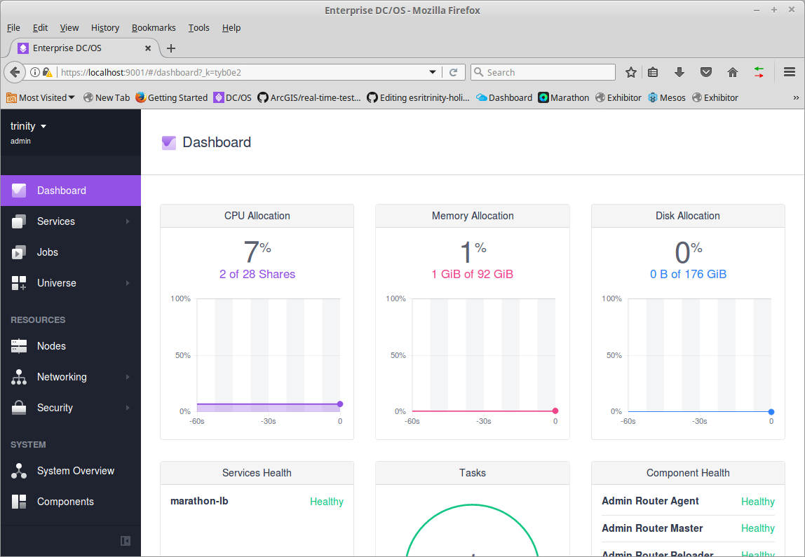
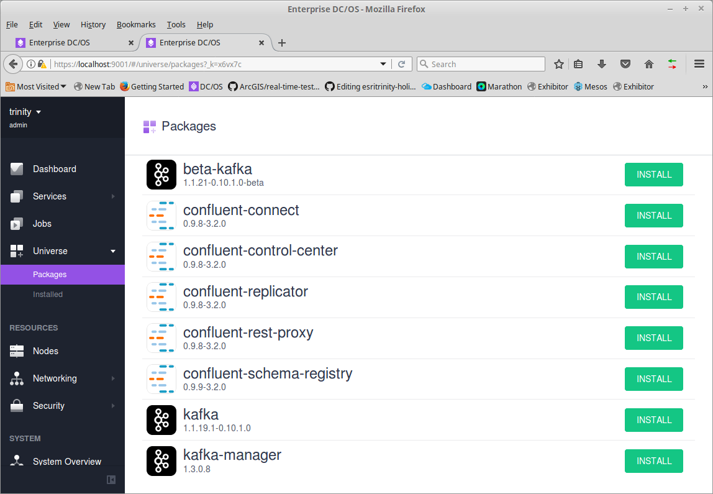
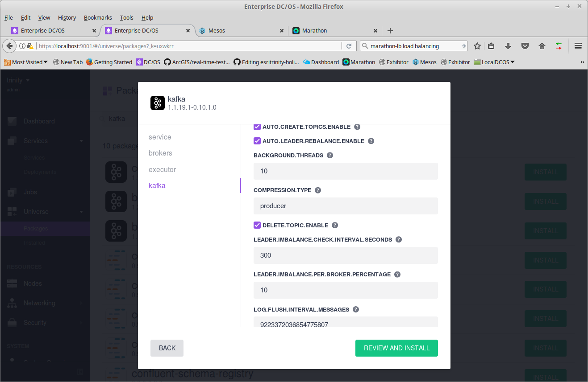
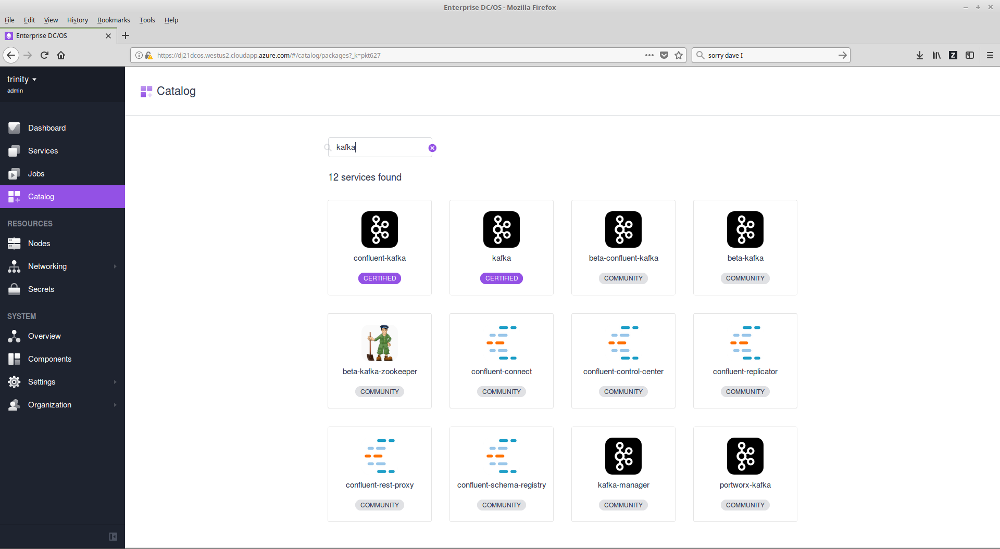
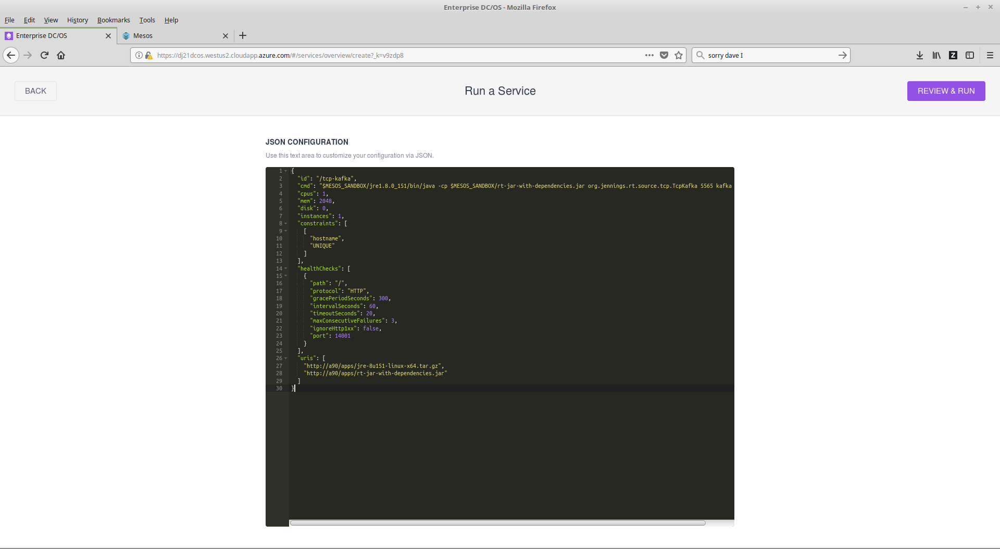
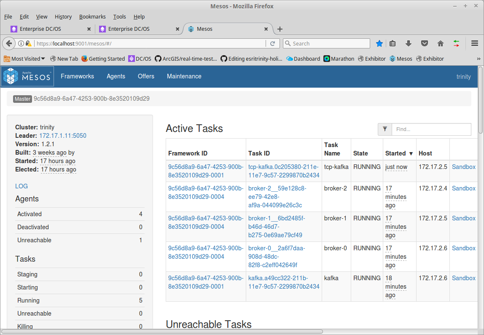

# Intro Test

This Document is detailed walk through of configuring and testing a DCOS app.  The input for this test (tcp-kafka) is a tcp listener that writes messages to a Kafka topic. The output is (kafka-cnt) an app that consumes a kafka topic and counts the messages.

## Building

These instructions are for CentOS 7.  Similar steps could be done in other OS's.

### Install Tools

The tools will be installed on a test server. The test server should be able to talk with nodes of the DCOS cluster but should not be a part of the cluster. You don't want to run test / development software on the DCOS nodes. I've found that if you add a note to the cluster then in the services disable the dcos-mesos service; that node can then be used as a test server.

As root on the test server.  

<pre>
yum -y install java-1.8.0-openjdk
yum -y install epel-release
yum -y install git
yum -y install maven
</pre>

- java because this is a Java app.
- epel-release add yum repo that includes git and maven
- git to allow you to clone this github project
- maven to allow you to build this project

### Clone and Build

As normal user

<pre>
git clone https://github.com/david618/rt/
cd rt
mvn install
</pre>

- git clone pulls the code down
- mvn builds the project (Takes a minute or two; should end with BUILD SUCCESS.

Do the same for Simulator
<pre>
git clone https://github.com/david618/Simulator
cd Simulator
mvn install
</pre>

- Simulator is a set of test apps 
- As before the compilation should end with BUILD SUCCESS

### Install DCOS

There are instructions [here](https://dcos.io/install/).  There are several options.  For initial testing I created several local VirtualBox VM's (m1, a1, a2, a3, p1); each with 2 cpus and 4G of RAM. I used my desktop which has 8 cores and 32GB RAM.  You might get by with 24GB RAM, but it might not perform very well.

We did performance testing using Virtual Machines on Azure and Instances on AWS.

### Install Web Server 

We'll be deploying services using Mesos containerization. Mesos will download the executable code from a web server. So we'll start a web server and put the exeutable code (jar) files and libraries in that folder.

*NOTE:* You could use app app server like Apache Tomcat. The advantage with Tomcat is it runs (by default) on port 8080 which you can run as a regular user. On the services you'll have to include the port in your URIS.  

As root on test server.

<pre>
yum -y install httpd
systemctl enable httpd
systemctl start httpd
</pre>

If you have a firewall installed you'll need to allow access to port 80. 

From one of the DCOS nodes verify that you can access the test server (my test server was named p2).

<pre>
curl p2
</pre>

You should get back the default http page for Apache.

### Copy File to Web Server

As root on the test server

<pre>
mkdir /var/www/html/apps
cp /home/azureuser/rt/target/rt-jar-with-dependencies.jar /var/www/html/apps
</pre>

- Make a directory apps in web server home directory
- Copy the jar to the apps folder

You should be able to download the file to any of the nodes.

<pre>
curl -O p2/apps/rt-jar-with-dependencies.jar
ls -lh rt-jar-with-dependencies.jar 
file rt-jar-with-dependencies.jar 
</pre>

The file command should report back that this is a Zip archive
(e.g. rt-jar-with-dependencies.jar: Zip archive data, at least v1.0 to extract)

If there is a web server error you'll get back html or text.

### Install or Position Java
You can install Java on each Mesos agent (recommended) or you can download Java and include it as "uri" in the configuration.

#### Install Java

As root on each agent.

<pre>
yum -y install java-1.8.0-openjdk
</pre>

You can do this from the "boot" server using ssh command.

<pre>
ssh -t -i azureuser a1 "sudo yum install -y java-1.8.0-openjdk" 
</pre>

Where a1 is one of the private agents.  This could easily be scripted to install on all agents.

#### Position Java

You can put a copy of the Java Runtime Environment on the Web Server.

I downloaded the JRE from [Oracle Download Page](http://www.oracle.com/technetwork/java/javase/downloads/index.html).  Selecting JRE; click Accept License; and download Linux x64 tar.gz file. 

After downloading I moved the file to my test server. Put a copy in /var/www/html/apps/

If you use this option you'll need to modify the "cmd" below to begin something like:
$MESOS_SANDBOX/jre1.8.0_91/bin/java 

You'll also need to include a URL to the jre.  
<pre>
"uris": [
    "http://p2/jre-8u91-linux-x64.tar.gz",
    "http://p2/apps/rt-jar-with-dependencies.jar"
  ]
</pre>

The advantages are you can choose what version of Java is used in the app.  Instead of using whatever is installed on the node. 

### Install Kafka

I created a SSH tunnel to my Azure instances so that I can acces the DCOS Web UI.  So you'll see localhost:9001 on my URL's yous may be different.

From DCOS select Universe Packages and search for Kafka.

Click Install for "kafka". Click Advanced Installation.  Under brokers you should change COUNT to 1 for a small local DCOS cluster.  

Also Check  Enable Delete check box.

Click Review and Install; Install. 

It'll take a min or so for kafka to deploy.  The default name of the kafka instance is "kafka".

### Create TCP Source
We'll create a TCP Source. The Source will listen for TCP input on a specified port.

Go to the Service Page

Click the "+" in the upper right corner to Run a Service.  Then click JSON Configuration.  

Enter the JSON (cut-n-paste).  Be sure to correct the path in the uris section as needed.

<pre>
{
  "id": "/tcp-kafka",
  "cmd": "java -cp $MESOS_SANDBOX/rt-jar-with-dependencies.jar org.jennings.rt.source.tcp.TcpKafka 5565 kafka simFile 14001",
  "cpus": 1,
  "mem": 2048,
  "disk": 0,
  "instances": 1,
  "constraints": [
    [
      "hostname",
      "UNIQUE"
    ]
  ],
  "healthChecks": [
    {
      "path": "/",
      "protocol": "HTTP",
      "gracePeriodSeconds": 300,
      "intervalSeconds": 60,
      "timeoutSeconds": 20,
      "maxConsecutiveFailures": 3,
      "ignoreHttp1xx": false,
      "port": 14001
    }
  ],
  "uris": [
    "http://p2/apps/rt-jar-with-dependencies.jar"
  ]
}
</pre>

Click Run Service

On the Mesos page.

If something goes wrong. Look at the messages in the Mesos stdout or stderr.

NOTE: You can run these tools at the command line on the test server for testing.

As regular user on test server.

<pre>
cd rt 
java -cp target/rt-jar-with-dependencies.jar org.jennings.rt.source.tcp.TcpKafka 5565 kafka simfile 14001
</pre>

This is very useful for debugging.

### Run Kafka Count 
This app just consumes a Kafka Topic and counts messages and rate at which those messages are received.

Create another Service.

<pre>
{
  "id": "/kafka-cnt",
  "cmd": "java -cp $MESOS_SANDBOX/rt-jar-with-dependencies.jar org.jennings.rt.sink.kafka.KafkaCnt kafka simFile group1 14002",
  "cpus": 1,
  "mem": 2048,
  "disk": 0,
  "instances": 1,
  "constraints": [
    [
      "hostname",
      "UNIQUE"
    ]
  ],
  "healthChecks": [
    {
      "path": "/",
      "protocol": "HTTP",
      "gracePeriodSeconds": 300,
      "intervalSeconds": 60,
      "timeoutSeconds": 20,
      "maxConsecutiveFailures": 3,
      "ignoreHttp1xx": false,
      "port": 14002
    }
  ],  
  "uris": [    
    "http://p2/apps/rt-jar-with-dependencies.jar"
  ]
}
</pre>

### Run Tests

The source (tcp-kafka) and the sink (kafka-cnt) both provide a web interface to access test results. 

From test server
<pre>
curl tcp-kafka.marathon.mesos:14001

curl kafka-cnt.marathon.mesos:14002
</pre>

The ports 14001 and 14002 were specified in the deployment.  The output is {"healthy":true}.  This is used by Marathon to return a health check so Marathon/DCOS show the app as Green/Healthy.

On the test server

We'll run Tcp tool to send the lines from simFile_1000_10s.dat to the tcp-kafka app.
<pre>
cd ~/Simulator 
java -cp target/Simulator.jar com.esri.simulator.Tcp tcp-kafka.marathon.mesos 5565 simFile_1000_10s.dat 100 1000

</pre>

The Tcp app will send lines from simFile_1000_10s.dat tcp-kafka.marathon.mesos on port 5565. It will attempt to send at the rate of 100/s for 1,000 lines.  Tcp will then display how many lines (messages) it sent and the actual measured rate at which they were sent. For example:

1000,99.70089730807578

Says Tcp send 1000 lines at the rate of 99.7/s.

You can get the count/rates from each of the DCOS apps using curl commands.

<pre>
curl tcp-kafka.marathon.mesos:14001/count; echo
curl kafka-cnt.marathon.mesos:14002/count; echo
</pre>

An entry is added to counts, and rates each time the service is run. 

NOTE: the latencies element was added for measuring timing of messages as they traverse from tcp to kafka. By default it is not enabled. 

You can run another test
<pre>
java -cp target/Simulator.jar com.esri.simulator.Tcp tcp-kafka.marathon.mesos 5565 simFile_1000_10s.dat 1000 10000
</pre>

Then get the results again.

<pre>
curl tcp-kafka.marathon.mesos:14001/count; echo
curl kafka-cnt.marathon.mesos:14002/count; echo
</pre>

You'll now see two elements in the counts and rates arrays.

To clear counts you can use reset call.

<pre>
curl tcp-kafka.marathon.mesos:14001/reset; echo
curl kafka-cnt.marathon.mesos:14002/reset; echo
</pre>

The reset command will clear results in counts and rates.

## Test Results

Running on Azure with DS4v2 (8 cores and 28GB memory)

Throughput

| Simulator   Requested/Measured       | tcp-kafka | kafka-cnt |
|------------------|-----------|-----------|
| 200,000/141,500   | 141,400    | 141300    |
| 200,000/63,900    200,000/64,400   | 128,100 | 127,700 |   

### Increasing Throughput

Stopped the apps (tcp-kafka) and (kafka-cnt).

Increased the number of partitions for the topic to 2.  Instructions on managing kafka [here](ManageKafkaTopics.md)

Scaled the apps (tcp-kafka) and (kafka-cnt) to have two instances each.

Ran two Simulators. Used IP's instead of DNS name.

<pre>
dig tcp-kafka.marathon.mesos

java -cp target/Simulator.jar com.esri.simulator.Tcp 172.17.2.4 5565 simFile_1000_10s.dat 200000 2000000
java -cp target/Simulator.jar com.esri.simulator.Tcp 172.17.2.5 5565 simFile_1000_10s.dat 200000 2000000
</pre>

Ran both commands at same time.

| Simulator   Requested/Measured       | tcp-kafka | kafka-cnt |
|------------------|-----------|-----------|
| 200,000/141,500   200,000/137,200| 277,700     | 273,600

You can double the througput by adding more instances of the sources and sinks.

