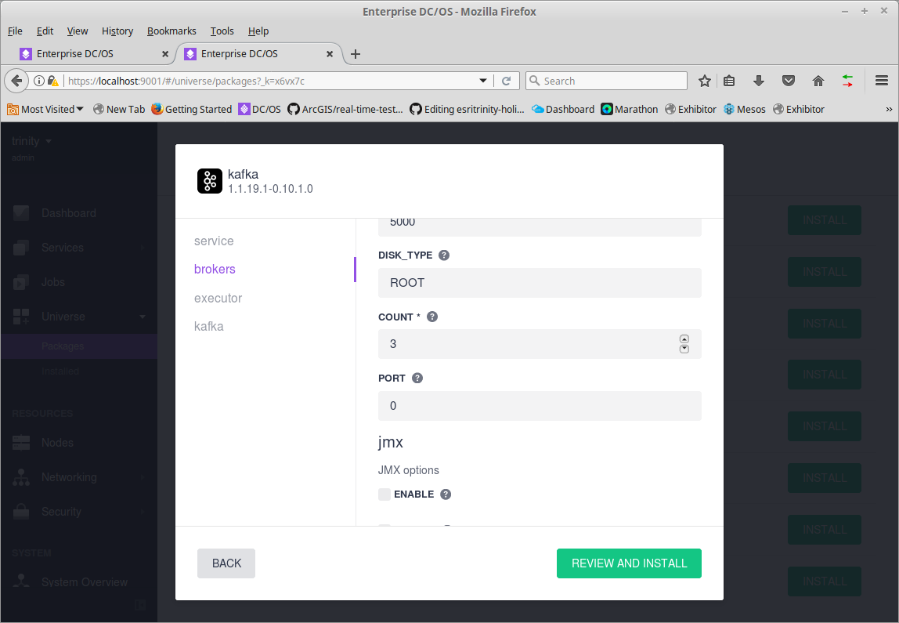

# Introduction to DC/OS Test

This Document is detailed walk through of configuring and testing a DC/OS application.  The input for this test (tcp-kafka) is a tcp listener that writes messages to a Kafka topic recording how many messages were written and the rate the messages were written to Kafka. The output (kafka-cnt) consumes a Kafka topic, counts the messages, and calculates the rate the messages were counted.

## Building Test Server

These instructions are for CentOS 7.  

### Install Test Tools

The tools will be installed on a test server(s). Each test server should be able to communicate to DC/OS nodes cluster but should not be a part of the cluster. Therefore, the test software will have less impact on the test results. You can add additional private or public agents to the cluster then disable the dcos mesos service (e.g. For Private Agent `systemctl stop dcos-mesos-slave`). The test server will have Mesos DNS installed and be able to communicate with the other nodes; but it will not run in DC/OS tasks.

The test server should have sufficient resources to support the testing. For these test an 8 cpu server like AWS m4.2xlarge or Azure DS4 would be a good choice. 

### Install Base Tools

<pre>
sudo yum -y install bash-completion 
sudo yum -y install epel-release
sudo yum -y install git
sudo yum -y install maven
sudo yum -y install python-httplib2
</pre>

- bash-completion is a nice bash tool for command line completion
- epel-release adds yum repo that includes git and maven
- git to allow you to clone this github project
- maven to allow you to build this project (This also install java)
- python-httplib2 allows pyhton to make http requests

### Clone and Build App and Test Tools

####  Test App
<pre>
git clone https://github.com/david618/rt/
cd rt
mvn install
</pre>

- git clone pulls the code down
- mvn install compiles the code (Takes a minute or so); should end with BUILD SUCCESS.
- This project includes the test apps (tcp-kafka, kafka-cnt, and more); More details are on the rt github page.

#### Simulator

Do the same for Simulator
<pre>
git clone https://github.com/david618/Simulator
cd Simulator
mvn install
</pre>

- Simulator is a set of test tools
- mvn install compiles the code
- As before the compilation should end with BUILD SUCCESS
- Project includes tools to send message, monitor Kafka topic, and more; More detilas re on the Simulator github page

### Install DCOS

There are instructions [here](https://dcos.io/install/).  There are several options.  For initial testing I created several local VirtualBox VM's (m1, a1, a2, a3, p1); each with 2 cpus and 4G of RAM. I used my desktop which has 8 cores and 32GB RAM.  You might get by with 24GB RAM, but it might not perform very well.

### Install Web Server 

**Note:** An alternative to setting up a web server is to store the files in an S3 Bucket or Azure Container and enable web access.  

We'll be deploying services using Universal Container Runtime (UCR). Mesos will download the executable code from a web server. So we'll start a web server and put the exeutable code (jar) files and libraries in that folder.

*NOTE:* You could use app app server like Apache Tomcat. The advantage with Tomcat is it runs (by default) on port 8080 which you can run as a regular user. On the services you'll have to include the port in your URIS.  

As root on test server.

<pre>
sudo yum -y install httpd
sudo systemctl enable httpd
sudo systemctl start httpd
</pre>

If you have a firewall installed you'll need to allow access to port 80. 

From one of the DC/OS nodes verify that you can access the test server (my test server was named p2).

<pre>
curl p2
</pre>

You should get back the default http page for Apache.

### Copy Files to Web Server

As root on the test server

<pre>
mkdir /var/www/html/apps
cp /home/azureuser/rt/target/rt-jar-with-dependencies.jar /var/www/html/apps
</pre>

- Make a directory apps in web server home directory
- Copy the jar to the apps folder

You should be able to download the file to any of the nodes.

<pre>
curl -O p2/apps/rt-jar-with-dependencies.jar
ls -lh rt-jar-with-dependencies.jar 
file rt-jar-with-dependencies.jar 
</pre>

The file command should report back that this is a Zip archive
(e.g. rt-jar-with-dependencies.jar: Zip archive data, at least v1.0 to extract)

If there is a web server error you'll get back html or text.

### Install or Position Java
You can install Java on each Mesos agent (recommended) or you can download Java and include it as "uri" in the configuration.

#### Install Java

As root on each agent.

<pre>
yum -y install java-1.8.0-openjdk
</pre>

You can do this from the "boot" server using ssh command.

<pre>
ssh -t -i azureuser a1 "sudo yum install -y java-1.8.0-openjdk" 
</pre>

Where a1 is one of the private agents.  This could easily be scripted to install on all agents.

#### Position Java

You can put a copy of the Java Runtime Environment on the Web Server.

I downloaded the JRE from [Oracle Download Page](http://www.oracle.com/technetwork/java/javase/downloads/index.html).  Selecting JRE; click Accept License; and download Linux x64 tar.gz file. 

After downloading I moved the file to my test server. Put a copy in /var/www/html/apps/

The advantage is you can choose what version of Java you can upgrade and you do not have to install on any of the nodes.

### Install Kafka

From DCOS select Catalog and search for Kafka.

Click Review &amp; Run. Click Edit.  Under brokers you should change COUNT to 1 for a small local DCOS cluster.  Adjust the DISK size; this is the space where Kafka will store messages. Default is 5000MB (or 5G). Be sure to make this large enough to support the test you are planning.  Under kafka section check "DELETE.TOPIC.ENABLE".

Click Review &amp; Run; Run Service

It'll take a min or so for kafka to deploy.  The default name of the kafka instance is "kafka".

### Create TCP Source
We'll create a TCP Source. The Source will listen for TCP input on a specified port.

Go to the Service Page

Click the "+" in the upper right corner to Run a Service.  Then click JSON Configuration.  

Enter the JSON (cut-n-paste).  Be sure to correct the path in the uris section as needed.  The a90 in the URL is the name of my test server.  If you installed java on all the agents you can remove the uris line for the jre and replace $MESOS_SANDBOX/jre1.8.0_151/bin/java with just java.

<pre>
{
  "id": "/tcp-kafka",
  "cmd": "$MESOS_SANDBOX/jre1.8.0_151/bin/java -cp $MESOS_SANDBOX/rt-jar-with-dependencies.jar org.jennings.rt.source.tcp.TcpKafka 5565 kafka simFile 14001",
  "cpus": 1,
  "mem": 2048,
  "disk": 0,
  "instances": 1,
  "constraints": [
    [
      "hostname",
      "UNIQUE"
    ]
  ],
  "healthChecks": [
    {
      "path": "/",
      "protocol": "HTTP",
      "gracePeriodSeconds": 300,
      "intervalSeconds": 60,
      "timeoutSeconds": 20,
      "maxConsecutiveFailures": 3,
      "ignoreHttp1xx": false,
      "port": 14001
    }
  ],
  "uris": [
    "http://a90/apps/jre-8u151-linux-x64.tar.gz",
    "http://a90/apps/rt-jar-with-dependencies.jar"
  ]
}
</pre>

Click Run Service

On the Mesos page.

If something goes wrong. Look at the messages in the Mesos stdout or stderr.

NOTE: You can run these tools at the command line on the test server for testing.

As regular user on test server.

<pre>
cd rt 
java -cp target/rt-jar-with-dependencies.jar org.jennings.rt.source.tcp.TcpKafka 5565 kafka simfile 14001
</pre>

This is very useful for debugging.

### Run Kafka Count 
This app just consumes a Kafka Topic and counts messages and rate at which those messages are received.

Create another Service.

<pre>
{
  "id": "/kafka-cnt",
  "cmd": "$MESOS_SANDBOX/jre1.8.0_151/bin/java -cp $MESOS_SANDBOX/rt-jar-with-dependencies.jar org.jennings.rt.sink.kafka.KafkaCnt kafka simFile group1 14002",
  "cpus": 1,
  "mem": 2048,
  "disk": 0,
  "instances": 1,
  "constraints": [
    [
      "hostname",
      "UNIQUE"
    ]
  ],
  "healthChecks": [
    {
      "path": "/",
      "protocol": "HTTP",
      "gracePeriodSeconds": 300,
      "intervalSeconds": 60,
      "timeoutSeconds": 20,
      "maxConsecutiveFailures": 3,
      "ignoreHttp1xx": false,
      "port": 14002
    }
  ],  
  "uris": [    
    "http://a90/apps/jre-8u151-linux-x64.tar.gz",
    "http://a90/apps/rt-jar-with-dependencies.jar"
  ]
}
</pre>

### Run Tests

The source (tcp-kafka) and the sink (kafka-cnt) both provide a web interface to access test results. 

From test server
<pre>
curl tcp-kafka.marathon.mesos:14001

curl kafka-cnt.marathon.mesos:14002
</pre>

The ports 14001 and 14002 were specified in the deployment.  The output is {"healthy":true}.  This is used by Marathon to return a health check so Marathon/DCOS show the app as Green/Healthy.

On the test server

We'll run Tcp tool to send the lines from simFile_1000_10s.dat to the tcp-kafka app.
<pre>
cd ~/Simulator 
java -cp target/Simulator.jar com.esri.simulator.Tcp tcp-kafka.marathon.mesos 5565 simFile_1000_10s.dat 100 1000

</pre>

The Tcp app will send lines from simFile_1000_10s.dat tcp-kafka.marathon.mesos on port 5565. It will attempt to send at the rate of 100/s for 1,000 lines.  Tcp will then display how many lines (messages) it sent and the actual measured rate at which they were sent. For example:

1000,100

Says Tcp send 1000 lines at the rate of 100/s.

You can get the count/rates from each of the DCOS apps using curl commands.

<pre>
curl tcp-kafka.marathon.mesos:14001/count; echo
curl kafka-cnt.marathon.mesos:14002/count; echo
</pre>

An entry is added to counts, and rates each time the service is run. 

NOTE: the latencies element was added for measuring timing of messages as they traverse from tcp to kafka. By default it is not enabled. 

You can run another test
<pre>
java -cp target/Simulator.jar com.esri.simulator.Tcp tcp-kafka.marathon.mesos 5565 simFile_1000_10s.dat 1000 10000
</pre>

Then get the results again.

<pre>
curl tcp-kafka.marathon.mesos:14001/count; echo
curl kafka-cnt.marathon.mesos:14002/count; echo
</pre>

You'll now see two elements in the counts and rates arrays.

To clear counts you can use reset call.

<pre>
curl tcp-kafka.marathon.mesos:14001/reset; echo
curl kafka-cnt.marathon.mesos:14002/reset; echo
</pre>

The reset command will clear results in counts and rates.

## Test Results

Running on Azure with DS4v2 (16 cores and 56GB memory)

Simulator

`java -cp target/Simulator.jar com.esri.simulator.Tcp tcp-kafka.marathon.mesos 5565 simFile_1000_10s.dat 200000 20000000`

Tried to send 20 Million Events at 200,000/s

| Simulator Rate (/s)   Requested| Simulator Rate (/s)   Achieved| tcp-kafka | kafka-cnt |
|--------------------|--------------------|-----------|-----------|
|100k                |100k                |100k       |100k       |
|200k                |166k                |166k       |166k       |

Observations
- Requested rate 200,000/s; however, the best rate I could achieve was 166,000/s
- No Events were lost 

### Increasing Throughput

#### Doubling the Configuration

Stopped the apps (tcp-kafka) and (kafka-cnt).

Increased the number of partitions for the topic to 2.  Instructions on managing kafka [here](ManageKafkaTopics.md)

Scaled the apps (tcp-kafka) and (kafka-cnt) to have two instances each.

#### Test with Faster Rate

Request faster rate
<pre>
java -cp target/Simulator.jar com.esri.simulator.Tcp tcp-kafka.marathon.mesos 5565 simFile_1000_10s.dat 400000 10000000
</pre>

The tcp app checks DNS name and starts two threads for sending events.

You could also use IP's and start two commands.

<pre>
java -cp target/Simulator.jar com.esri.simulator.Tcp 172.17.2.9 5565 simFile_1000_10s.dat 200000 10000000
java -cp target/Simulator.jar com.esri.simulator.Tcp 172.17.2.6 5565 simFile_1000_10s.dat 200000 10000000
</pre>

#### Manually Collect Results

Get the IP's for the services
<pre>
dig tcp-kafka.marathon.mesos
</pre>

You can curl to each to get the rates. 

<pre>
curl 172.17.2.6:14001/count;echo
curl 172.17.2.9:14001/count;echo
</pre>

Each instance counts a portion of messages and calculates it's rate.  The sum of the counts is the total number of messages and the sum of rates it the peak rate. 

#### Example Test Results

| Simulator Rate (/s)   Requested| Simulator Rate (/s)   Achieved| tcp-kafka | kafka-cnt |
|--------------------|--------------------|-----------|-----------|
|200k                |200k                |200k       |200k       |
|400k                |339k                |339k       |339k       |

Observation
- You can double the througput by doubling instances of sources, sinks, and partitions of kafka topic.

